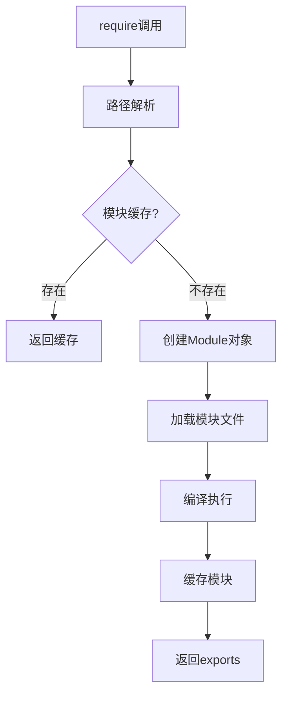

# Node.js 模块加载机制详解


## 📚 目录
- [核心概念](#核心概念)
- [require函数工作原理](#require函数工作原理)
- [模块解析算法](#模块解析算法)
- [模块缓存机制](#模块缓存机制)
- [循环依赖处理](#循环依赖处理)
- [不同模块系统对比](#不同模块系统对比)
- [实际应用场景](#实际应用场景)
- [性能优化](#性能优化)

## 🎯 核心概念

### 1. 模块系统基础

Node.js 采用 **CommonJS** 模块规范，每个文件都是一个独立的模块：

```javascript
// 模块的基本结构
(function(exports, require, module, __filename, __dirname) {
    // 你的模块代码
});
```

### 2. 模块类型分类

| 模块类型 | 描述 | 示例 |
|---------|------|------|
| **核心模块** | Node.js内置模块 | `fs`, `path`, `http` |
| **本地模块** | 项目中的文件模块 | `./utils.js`, `../config.js` |
| **第三方模块** | npm安装的模块 | `lodash`, `express` |

### 3. 模块对象结构

```javascript
// module对象的核心属性
module = {
    id: '.',                    // 模块标识符
    filename: '/path/to/file',  // 模块文件名
    loaded: false,              // 是否已加载完成
    parent: null,               // 父模块
    children: [],               // 子模块数组
    exports: {},                // 导出对象
    paths: []                   // 模块搜索路径
};
```

## ⚙️ require函数工作原理

### 1. require函数执行流程



### 2. 详细执行步骤

#### 步骤1: 路径解析 (Module._resolveFilename)
```javascript
// 解析模块路径的优先级
1. 核心模块 (如 'fs', 'path')
2. 相对路径 ('./module', '../module')
3. 绝对路径 ('/path/to/module')
4. node_modules 查找
```

#### 步骤2: 模块缓存检查
```javascript
// 检查 Module._cache
if (Module._cache[filename]) {
    return Module._cache[filename].exports;
}
```

#### 步骤3: 创建模块对象
```javascript
const module = new Module(filename, parent);
```

#### 步骤4: 文件加载与编译
```javascript
// 根据文件扩展名选择加载器
Module._extensions['.js']   // JavaScript文件
Module._extensions['.json'] // JSON文件
Module._extensions['.node'] // C++扩展
```

## 🔍 模块解析算法

### 1. 文件解析规则

```javascript
// require('./example') 的解析顺序
1. ./example.js
2. ./example.json
3. ./example.node
4. ./example/package.json (main字段)
5. ./example/index.js
6. ./example/index.json
7. ./example/index.node
```

### 2. node_modules 查找算法

```javascript
// require('lodash') 的查找路径
/current/path/node_modules/lodash
/current/node_modules/lodash
/node_modules/lodash
/Users/username/node_modules/lodash
/Users/node_modules/lodash
/node_modules/lodash
```

### 3. 路径解析示例

```javascript
// 当前文件: /Users/project/src/utils/helper.js
require('fs')           // 核心模块
require('./config')     // /Users/project/src/utils/config.js
require('../data')      // /Users/project/src/data.js
require('lodash')       // node_modules查找
require('/abs/path')    // 绝对路径
```

## 💾 模块缓存机制

### 1. 缓存原理

```javascript
// Module._cache 结构
Module._cache = {
    '/path/to/module.js': {
        id: '/path/to/module.js',
        exports: { /* 导出内容 */ },
        loaded: true,
        // ... 其他属性
    }
};
```

### 2. 缓存特点

- **基于绝对路径**: 相同绝对路径的模块只加载一次
- **引用共享**: 所有require返回同一个exports对象
- **动态更新**: 模块内部状态变化会影响所有引用

### 3. 缓存管理

```javascript
// 查看缓存
console.log(require.cache);

// 删除缓存 (谨慎使用)
delete require.cache[require.resolve('./module')];

// 清空所有缓存
Object.keys(require.cache).forEach(key => {
    delete require.cache[key];
});
```

## 🔄 循环依赖处理

### 1. 循环依赖问题

```javascript
// a.js
const b = require('./b');
module.exports = { name: 'a', b };

// b.js  
const a = require('./a');  // 此时a.js还未完全加载
module.exports = { name: 'b', a };
```

### 2. Node.js解决方案

- **部分导出**: 返回已经执行部分的exports
- **避免死锁**: 通过缓存机制防止无限递归
- **延迟引用**: 在函数内部require可以解决部分问题

### 3. 最佳实践

```javascript
// ❌ 避免顶层循环依赖
const b = require('./b');

// ✅ 函数内部引用
function getB() {
    return require('./b');
}

// ✅ 依赖注入
function createA(b) {
    return { name: 'a', b };
}
```

## 📊 不同模块系统对比

| 特性 | CommonJS | ES6 Module | AMD | UMD |
|------|----------|------------|-----|-----|
| **加载时机** | 运行时 | 编译时 | 运行时 | 运行时 |
| **加载方式** | 同步 | 异步 | 异步 | 同步/异步 |
| **导出方式** | `module.exports` | `export` | `define` | 通用 |
| **导入方式** | `require()` | `import` | `require()` | 通用 |
| **树摇优化** | ❌ | ✅ | ❌ | ❌ |
| **静态分析** | ❌ | ✅ | ❌ | ❌ |

### CommonJS vs ES6 Module

```javascript
// CommonJS
const { readFile } = require('fs');
module.exports = { helper };

// ES6 Module  
import { readFile } from 'fs';
export { helper };
export default helper;
```

## 🚀 实际应用场景

### 1. 模块设计模式

```javascript
// 单例模式
class Database {
    constructor() {
        if (Database.instance) {
            return Database.instance;
        }
        Database.instance = this;
    }
}
module.exports = new Database();

// 工厂模式
module.exports = {
    createLogger: (type) => {
        switch(type) {
            case 'file': return new FileLogger();
            case 'console': return new ConsoleLogger();
        }
    }
};
```

### 2. 配置管理

```javascript
// config/index.js
const env = process.env.NODE_ENV || 'development';
const configs = {
    development: require('./dev'),
    production: require('./prod'),
    test: require('./test')
};
module.exports = configs[env];
```

### 3. 插件系统

```javascript
// 动态加载插件
const plugins = [];
const pluginDir = path.join(__dirname, 'plugins');

fs.readdirSync(pluginDir).forEach(file => {
    if (file.endsWith('.js')) {
        const plugin = require(path.join(pluginDir, file));
        plugins.push(plugin);
    }
});
```

## ⚡ 性能优化

### 1. 减少模块加载开销

```javascript
// ❌ 避免重复require
function processData() {
    const _ = require('lodash');  // 每次调用都require
    return _.map(data, item => item.value);
}

// ✅ 顶层require
const _ = require('lodash');
function processData() {
    return _.map(data, item => item.value);
}
```

### 2. 懒加载策略

```javascript
// 懒加载大型模块
let heavyModule;
function getHeavyModule() {
    if (!heavyModule) {
        heavyModule = require('./heavy-module');
    }
    return heavyModule;
}
```

### 3. 模块预加载

```javascript
// 预加载关键模块
const criticalModules = [
    'fs', 'path', 'util',
    './config', './logger'
];

criticalModules.forEach(mod => {
    require(mod);
});
```

## 🛠️ 调试技巧

### 1. 模块加载追踪

```javascript
// 启用模块加载日志
NODE_DEBUG=module node app.js

// 查看模块解析过程
console.log(require.resolve('./module'));
console.log(require.resolve.paths('lodash'));
```

### 2. 缓存分析

```javascript
// 分析模块缓存
function analyzeCache() {
    const cache = require.cache;
    console.log('已缓存模块数量:', Object.keys(cache).length);
    
    Object.keys(cache).forEach(key => {
        const module = cache[key];
        console.log(`${key}: ${module.loaded ? '已加载' : '加载中'}`);
    });
}
```

## 📝 最佳实践

### 1. 模块组织原则

- **单一职责**: 每个模块只负责一个功能
- **明确接口**: 清晰的导入导出接口
- **避免副作用**: 模块加载不应产生副作用
- **文档完善**: 提供清晰的使用文档

### 2. 性能考虑

- **合理缓存**: 利用模块缓存机制
- **按需加载**: 避免加载不必要的模块
- **循环依赖**: 设计时避免循环依赖
- **模块大小**: 控制单个模块的复杂度

### 3. 安全注意事项

- **路径验证**: 验证动态require的路径
- **权限控制**: 限制模块访问权限
- **依赖审计**: 定期审计第三方依赖

## 🔗 参考资料

* [深入Node.js的模块加载机制，手写require函数](https://juejin.cn/post/6866973719634542606)
* [NodeJs模块加载流程分析（require）](https://www.jianshu.com/p/a309864c8357)
* [Node.js官方文档 - Modules](https://nodejs.org/api/modules.html)
* [CommonJS规范](http://wiki.commonjs.org/wiki/Modules/1.1)

---

> 💡 **提示**: 理解模块加载机制对于Node.js开发至关重要，它影响应用的性能、架构设计和调试效率。