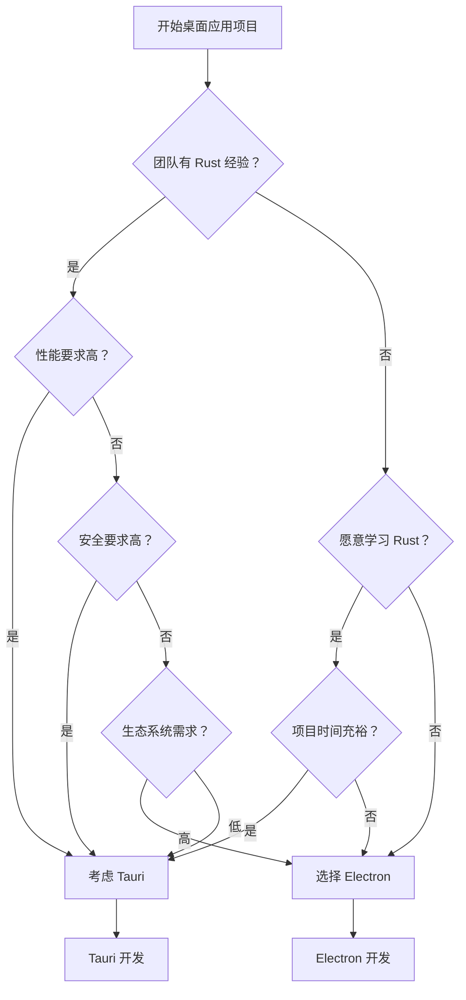

# Tauri vs Electron 深度对比分析

## 参考资料
* [构建跨平台的快速、安全、前端隔离应用](https://tauri.app/zh/)
* [初步尝试 tauri，并且与 electron.js 对比](https://juejin.cn/post/7059400669916037133)

## 目录
1. [架构对比](#1-架构对比)
2. [性能对比](#2-性能对比)
3. [安全性对比](#3-安全性对比)
4. [开发体验对比](#4-开发体验对比)
5. [生态系统对比](#5-生态系统对比)
6. [适用场景分析](#6-适用场景分析)
7. [选择建议](#7-选择建议)

## 1. 架构对比

### 1.1 Electron 架构

```
┌─────────────────────────────────────┐
│           Electron 应用              │
├─────────────────────────────────────┤
│  主进程 (Main Process)               │
│  ├─ Node.js Runtime                 │
│  ├─ 应用生命周期管理                  │
│  └─ 原生 API 访问                   │
├─────────────────────────────────────┤
│  渲染进程 (Renderer Process)         │
│  ├─ Chromium 浏览器引擎              │
│  ├─ HTML/CSS/JavaScript             │
│  └─ Web APIs                       │
├─────────────────────────────────────┤
│  IPC (进程间通信)                    │
│  ├─ ipcMain / ipcRenderer           │
│  └─ 消息传递机制                     │
└─────────────────────────────────────┘
```

**特点：**
- 基于 Chromium + Node.js
- 多进程架构
- 完整的浏览器环境
- JavaScript 作为主要开发语言

### 1.2 Tauri 架构

```
┌─────────────────────────────────────┐
│            Tauri 应用               │
├─────────────────────────────────────┤
│  Rust 后端 (Core)                   │
│  ├─ Tauri Runtime                  │
│  ├─ 系统 API 绑定                   │
│  ├─ 安全策略管理                     │
│  └─ 原生功能实现                     │
├─────────────────────────────────────┤
│  前端 (Frontend)                    │
│  ├─ 系统 WebView                   │
│  ├─ HTML/CSS/JavaScript            │
│  └─ 任意前端框架                     │
├─────────────────────────────────────┤
│  通信层 (Communication)             │
│  ├─ Command 系统                   │
│  ├─ Event 系统                     │
│  └─ JSON-RPC 协议                  │
└─────────────────────────────────────┘
```

**特点：**
- 基于 Rust + 系统 WebView
- 单进程架构（主要）
- 轻量级 WebView 环境
- Rust 作为后端，前端技术栈灵活

## 2. 性能对比

### 2.1 内存占用

#### Electron
```bash
# 典型的 Electron 应用内存占用
Hello World 应用: ~100-150MB
VS Code: ~200-500MB
Discord: ~300-800MB
Slack: ~400-600MB
```

**原因：**
- 每个应用都包含完整的 Chromium 引擎
- Node.js 运行时开销
- 多进程架构的内存开销

#### Tauri
```bash
# 典型的 Tauri 应用内存占用
Hello World 应用: ~10-30MB
中等复杂应用: ~50-100MB
复杂应用: ~100-200MB
```

**原因：**
- 使用系统原生 WebView
- Rust 的零成本抽象
- 单进程架构

### 2.2 应用大小

#### Electron
```bash
# 应用打包大小
最小应用: ~120MB (包含 Chromium)
典型应用: ~150-300MB
复杂应用: ~300MB+

# 组成部分
Chromium 引擎: ~100MB
Node.js 运行时: ~20MB
应用代码: 变量
```

#### Tauri
```bash
# 应用打包大小
最小应用: ~10-20MB
典型应用: ~20-50MB
复杂应用: ~50-100MB

# 组成部分
Rust 运行时: ~5-10MB
WebView 依赖: 系统提供
应用代码: 变量
```

### 2.3 启动速度

#### 性能测试对比
```javascript
// 启动时间对比 (毫秒)
const performanceComparison = {
  electron: {
    coldStart: 1500-3000,  // 冷启动
    warmStart: 800-1500,   // 热启动
    factors: [
      'Chromium 引擎初始化',
      'Node.js 运行时启动',
      '多进程创建开销'
    ]
  },
  tauri: {
    coldStart: 300-800,    // 冷启动
    warmStart: 200-500,    // 热启动
    factors: [
      'Rust 运行时启动',
      '系统 WebView 初始化',
      '单进程架构优势'
    ]
  }
};
```

### 2.4 运行时性能

#### CPU 使用率
```rust
// Tauri 的性能优势
pub struct PerformanceMetrics {
    pub cpu_usage: f32,      // 通常更低
    pub memory_efficiency: f32, // 更高的内存效率
    pub battery_life: f32,   // 更好的电池续航
}

// Rust 的零成本抽象
impl PerformanceMetrics {
    pub fn tauri_advantages() -> Vec<&'static str> {
        vec![
            "编译时优化",
            "无垃圾回收开销",
            "系统级性能",
            "更少的 CPU 周期"
        ]
    }
}
```

## 3. 安全性对比

### 3.1 Electron 安全挑战

#### 安全风险
```javascript
// Electron 常见安全问题
const electronSecurityRisks = {
  nodeIntegration: {
    risk: "Node.js API 暴露给渲染进程",
    impact: "可能执行任意系统命令",
    mitigation: "禁用 nodeIntegration"
  },
  
  contextIsolation: {
    risk: "上下文污染",
    impact: "恶意脚本访问 Electron API",
    mitigation: "启用 contextIsolation"
  },
  
  remoteModule: {
    risk: "远程模块访问",
    impact: "直接访问主进程 API",
    mitigation: "避免使用 remote 模块"
  }
};

// 安全配置示例
const secureElectronConfig = {
  webPreferences: {
    nodeIntegration: false,           // 禁用 Node.js 集成
    contextIsolation: true,           // 启用上下文隔离
    enableRemoteModule: false,        // 禁用远程模块
    sandbox: true,                    // 启用沙箱
    preload: path.join(__dirname, 'preload.js')
  }
};
```

#### 安全最佳实践
```javascript
// Electron 安全检查清单
const electronSecurityChecklist = [
  "✓ 禁用 Node.js 集成",
  "✓ 启用上下文隔离",
  "✓ 使用 preload 脚本",
  "✓ 验证所有 IPC 消息",
  "✓ 实施 CSP 策略",
  "✓ 定期更新 Electron 版本",
  "✓ 使用代码签名",
  "✓ 实施安全的更新机制"
];
```

### 3.2 Tauri 安全优势

#### 内置安全特性
```rust
// Tauri 的安全架构
use tauri::api::shell;

#[tauri::command]
async fn secure_command(input: String) -> Result<String, String> {
    // 1. 输入验证
    if input.len() > 1000 {
        return Err("Input too long".to_string());
    }
    
    // 2. 权限检查
    if !has_permission(&input) {
        return Err("Permission denied".to_string());
    }
    
    // 3. 安全执行
    Ok(process_safely(input))
}

// 权限系统
pub struct TauriPermissions {
    pub fs_read: bool,      // 文件系统读取
    pub fs_write: bool,     // 文件系统写入
    pub shell_execute: bool, // Shell 执行
    pub network_access: bool, // 网络访问
}
```

#### 配置驱动的安全
```json
// tauri.conf.json 安全配置
{
  "tauri": {
    "allowlist": {
      "all": false,
      "fs": {
        "all": false,
        "readFile": true,
        "writeFile": false,
        "scope": ["$APPDATA/myapp/*"]
      },
      "shell": {
        "all": false,
        "execute": false,
        "open": true
      },
      "http": {
        "all": false,
        "request": true,
        "scope": ["https://api.myapp.com/*"]
      }
    },
    "security": {
      "csp": "default-src 'self'; script-src 'self' 'unsafe-inline'"
    }
  }
}
```

### 3.3 安全对比总结

| 安全方面 | Electron | Tauri |
|---------|----------|-------|
| **默认安全性** | 需要手动配置 | 默认安全 |
| **权限模型** | 全权限，需限制 | 最小权限原则 |
| **API 访问** | 通过 IPC | 通过 Command 系统 |
| **代码注入** | 风险较高 | 风险较低 |
| **更新安全** | 需要额外实现 | 内置安全更新 |
| **沙箱隔离** | 可选配置 | 默认隔离 |

## 4. 开发体验对比

### 4.1 Electron 开发体验

#### 优势
```javascript
// Electron 开发优势
const electronAdvantages = {
  ecosystem: {
    maturity: "成熟的生态系统",
    packages: "丰富的 npm 包支持",
    community: "庞大的开发者社区",
    resources: "大量学习资源和文档"
  },
  
  development: {
    language: "纯 JavaScript/TypeScript",
    debugging: "熟悉的浏览器调试工具",
    hotReload: "快速的热重载",
    testing: "完善的测试工具链"
  },
  
  deployment: {
    platforms: "支持所有主流平台",
    distribution: "多种分发方式",
    updates: "成熟的自动更新方案"
  }
};

// 典型的 Electron 开发流程
const electronWorkflow = {
  setup: "npm init electron-app my-app",
  development: "npm start",
  debugging: "Chrome DevTools",
  building: "electron-builder",
  distribution: "GitHub Releases / App Store"
};
```

#### 挑战
```javascript
const electronChallenges = {
  performance: "性能优化复杂",
  security: "安全配置繁琐",
  size: "应用体积大",
  updates: "更新机制复杂",
  native: "原生功能集成困难"
};
```

### 4.2 Tauri 开发体验

#### 优势
```rust
// Tauri 开发优势
use tauri::Builder;

fn main() {
    Builder::default()
        .invoke_handler(tauri::generate_handler![
            my_custom_command,
            file_operations,
            system_info
        ])
        .run(tauri::generate_context!())
        .expect("error while running tauri application");
}

// 类型安全的命令系统
#[tauri::command]
async fn my_custom_command(input: MyInput) -> Result<MyOutput, MyError> {
    // 编译时类型检查
    // 自动序列化/反序列化
    // 错误处理
    Ok(process_input(input).await?)
}
```

#### 学习曲线
```rust
// Tauri 学习要求
pub struct LearningCurve {
    pub rust_basics: bool,      // 需要学习 Rust 基础
    pub tauri_concepts: bool,   // Tauri 特定概念
    pub frontend_skills: bool,  // 前端技能（已有）
    pub system_programming: bool, // 系统编程概念
}

impl LearningCurve {
    pub fn time_investment() -> &'static str {
        "对于前端开发者：2-4 周学习 Rust 基础 + 1-2 周学习 Tauri"
    }
}
```

### 4.3 开发工具对比

#### Electron 工具链
```json
{
  "development": {
    "framework": "Electron",
    "language": "JavaScript/TypeScript",
    "bundler": "Webpack/Vite",
    "testing": "Jest/Mocha",
    "debugging": "Chrome DevTools",
    "building": "electron-builder/electron-forge"
  },
  "ecosystem": {
    "maturity": "★★★★★",
    "documentation": "★★★★★",
    "community": "★★★★★",
    "third_party": "★★★★★"
  }
}
```

#### Tauri 工具链
```json
{
  "development": {
    "framework": "Tauri",
    "backend": "Rust",
    "frontend": "Any (React/Vue/Svelte/Vanilla)",
    "bundler": "Vite/Webpack (前端) + Cargo (后端)",
    "testing": "Cargo test + 前端测试框架",
    "debugging": "Rust Analyzer + Browser DevTools",
    "building": "tauri build"
  },
  "ecosystem": {
    "maturity": "★★★☆☆",
    "documentation": "★★★★☆",
    "community": "★★★☆☆",
    "third_party": "★★☆☆☆"
  }
}
```

## 5. 生态系统对比

### 5.1 Electron 生态系统

#### 成熟度
```javascript
const electronEcosystem = {
  applications: [
    "VS Code", "Discord", "Slack", "WhatsApp Desktop",
    "Figma", "Notion", "Spotify", "Postman"
  ],
  
  libraries: {
    ui: ["Electron React Boilerplate", "Electron Vue"],
    utilities: ["electron-updater", "electron-store"],
    development: ["electron-reload", "electron-debug"],
    packaging: ["electron-builder", "electron-forge"]
  },
  
  community: {
    github_stars: "100k+",
    npm_downloads: "2M+ weekly",
    stackoverflow_questions: "50k+",
    tutorials: "数千个教程和课程"
  }
};
```

#### 第三方集成
```javascript
// Electron 的丰富集成
const electronIntegrations = {
  databases: ["SQLite", "IndexedDB", "LevelDB"],
  apis: ["REST", "GraphQL", "WebSocket"],
  services: ["Firebase", "AWS", "Google APIs"],
  native: ["Native modules", "C++ addons"],
  testing: ["Spectron", "Playwright", "Puppeteer"]
};
```

### 5.2 Tauri 生态系统

#### 发展状况
```rust
// Tauri 生态系统现状
pub struct TauriEcosystem {
    pub maturity: EcosystemMaturity,
    pub plugins: Vec<TauriPlugin>,
    pub community: CommunityMetrics,
}

pub enum EcosystemMaturity {
    Emerging,      // 新兴阶段
    Growing,       // 快速发展
    Stable,        // 稳定（目标）
}

pub struct TauriPlugin {
    pub name: String,
    pub functionality: String,
    pub status: PluginStatus,
}

// 官方插件
const OFFICIAL_PLUGINS: &[&str] = &[
    "tauri-plugin-fs-extra",
    "tauri-plugin-store",
    "tauri-plugin-window-state",
    "tauri-plugin-updater",
    "tauri-plugin-notification"
];
```

#### 社区发展
```rust
// Tauri 社区指标
pub struct CommunityMetrics {
    pub github_stars: u32,        // 70k+ (快速增长)
    pub discord_members: u32,     // 15k+
    pub crates_downloads: u32,    // 稳步增长
    pub ecosystem_plugins: u32,   // 50+ 插件
}

impl CommunityMetrics {
    pub fn growth_trend() -> &'static str {
        "快速增长，但仍在早期阶段"
    }
}
```

## 6. 适用场景分析

### 6.1 选择 Electron 的场景

#### 理想场景
```javascript
const electronIdealCases = {
  teamSkills: {
    description: "团队主要是前端开发者",
    skills: ["JavaScript/TypeScript", "React/Vue/Angular", "Node.js"],
    learning_cost: "低"
  },
  
  projectRequirements: {
    timeline: "紧急项目，需要快速上线",
    complexity: "复杂的 UI 交互和动画",
    integration: "需要大量第三方 npm 包",
    platforms: "需要支持所有桌面平台"
  },
  
  businessNeeds: {
    performance: "性能要求不是最高优先级",
    resources: "可以接受较大的资源占用",
    maintenance: "有经验的团队维护"
  }
};

// 典型应用类型
const electronApplicationTypes = [
  "代码编辑器 (VS Code)",
  "设计工具 (Figma)",
  "通讯软件 (Discord, Slack)",
  "音乐播放器 (Spotify)",
  "开发工具 (Postman)",
  "笔记应用 (Notion)",
  "原型工具 (Framer)"
];
```

### 6.2 选择 Tauri 的场景

#### 理想场景
```rust
// Tauri 适用场景
pub struct TauriIdealCases {
    pub performance_critical: bool,    // 性能敏感应用
    pub resource_constrained: bool,    // 资源受限环境
    pub security_focused: bool,        // 安全要求高
    pub native_integration: bool,      // 需要深度系统集成
}

impl TauriIdealCases {
    pub fn application_types() -> Vec<&'static str> {
        vec![
            "系统工具和实用程序",
            "文件管理器",
            "系统监控工具",
            "轻量级编辑器",
            "游戏启动器",
            "密码管理器",
            "加密工具",
            "IoT 设备管理",
            "嵌入式系统界面"
        ]
    }
    
    pub fn team_requirements() -> TeamRequirements {
        TeamRequirements {
            rust_knowledge: "基础到中级",
            learning_investment: "2-4 周",
            system_programming: "有帮助但非必需",
            frontend_skills: "必需"
        }
    }
}
```

### 6.3 场景决策矩阵

```rust
// 决策矩阵
pub struct DecisionMatrix {
    pub factors: Vec<DecisionFactor>,
}

pub struct DecisionFactor {
    pub name: String,
    pub electron_score: u8,  // 1-10
    pub tauri_score: u8,     // 1-10
    pub weight: f32,         // 权重
}

impl DecisionMatrix {
    pub fn create_matrix() -> Self {
        Self {
            factors: vec![
                DecisionFactor {
                    name: "开发速度".to_string(),
                    electron_score: 9,
                    tauri_score: 6,
                    weight: 0.2,
                },
                DecisionFactor {
                    name: "性能表现".to_string(),
                    electron_score: 5,
                    tauri_score: 9,
                    weight: 0.25,
                },
                DecisionFactor {
                    name: "安全性".to_string(),
                    electron_score: 6,
                    tauri_score: 9,
                    weight: 0.2,
                },
                DecisionFactor {
                    name: "生态系统".to_string(),
                    electron_score: 10,
                    tauri_score: 5,
                    weight: 0.15,
                },
                DecisionFactor {
                    name: "学习成本".to_string(),
                    electron_score: 8,
                    tauri_score: 4,
                    weight: 0.1,
                },
                DecisionFactor {
                    name: "资源占用".to_string(),
                    electron_score: 3,
                    tauri_score: 9,
                    weight: 0.1,
                },
            ]
        }
    }
}
```

## 7. 选择建议

### 7.1 选择 Electron 如果：

```javascript
const chooseElectron = {
  team: [
    "团队主要由前端开发者组成",
    "对 Rust 没有经验或学习意愿",
    "项目时间紧迫，需要快速交付"
  ],
  
  project: [
    "复杂的 UI 界面和交互",
    "需要大量第三方 JavaScript 库",
    "Web 应用移植到桌面",
    "需要丰富的调试和开发工具"
  ],
  
  business: [
    "性能不是最高优先级",
    "可以接受较大的应用体积",
    "目标用户设备性能较好",
    "需要快速进入市场"
  ]
};
```

### 7.2 选择 Tauri 如果：

```rust
// 选择 Tauri 的条件
pub struct ChooseTauri {
    pub performance_requirements: PerformanceNeeds,
    pub security_requirements: SecurityNeeds,
    pub team_capabilities: TeamCapabilities,
    pub project_characteristics: ProjectCharacteristics,
}

impl ChooseTauri {
    pub fn performance_needs() -> Vec<&'static str> {
        vec![
            "应用需要在低配置设备上运行",
            "内存使用是关键考虑因素",
            "启动速度要求很高",
            "电池续航很重要（移动设备）"
        ]
    }
    
    pub fn security_needs() -> Vec<&'static str> {
        vec![
            "处理敏感数据",
            "需要高安全标准",
            "企业级安全要求",
            "需要最小攻击面"
        ]
    }
    
    pub fn team_readiness() -> Vec<&'static str> {
        vec![
            "团队愿意学习 Rust",
            "有系统编程经验",
            "项目时间允许学习新技术",
            "长期项目维护计划"
        ]
    }
}
```

### 7.3 混合策略

```rust
// 渐进式迁移策略
pub struct HybridStrategy {
    pub phase1: Phase,
    pub phase2: Phase,
    pub phase3: Phase,
}

impl HybridStrategy {
    pub fn electron_to_tauri_migration() -> Self {
        Self {
            phase1: Phase {
                description: "使用 Electron 快速原型和 MVP",
                duration: "1-3 个月",
                goal: "验证产品市场契合度"
            },
            phase2: Phase {
                description: "团队学习 Rust 和 Tauri",
                duration: "2-4 个月",
                goal: "技术能力建设"
            },
            phase3: Phase {
                description: "逐步迁移到 Tauri",
                duration: "3-6 个月",
                goal: "性能和安全优化"
            }
        }
    }
}
```

### 7.4 决策流程图



## 总结

### 核心对比要点

| 维度 | Electron | Tauri | 推荐场景 |
|------|----------|-------|----------|
| **性能** | ⭐⭐⭐ | ⭐⭐⭐⭐⭐ | 性能敏感选 Tauri |
| **开发速度** | ⭐⭐⭐⭐⭐ | ⭐⭐⭐ | 快速开发选 Electron |
| **安全性** | ⭐⭐⭐ | ⭐⭐⭐⭐⭐ | 安全要求高选 Tauri |
| **生态系统** | ⭐⭐⭐⭐⭐ | ⭐⭐⭐ | 复杂功能选 Electron |
| **学习成本** | ⭐⭐⭐⭐ | ⭐⭐ | 前端团队选 Electron |
| **应用大小** | ⭐⭐ | ⭐⭐⭐⭐⭐ | 分发考虑选 Tauri |

### 最终建议

1. **新项目且团队有学习能力** → 考虑 Tauri
2. **现有 Web 应用迁移** → 选择 Electron
3. **性能和安全优先** → 选择 Tauri
4. **快速原型和 MVP** → 选择 Electron
5. **长期项目** → 考虑 Tauri 的投资回报
6. **企业级应用** → 根据具体需求权衡

两个框架都有各自的优势，选择应该基于项目需求、团队能力和业务目标的综合考虑。