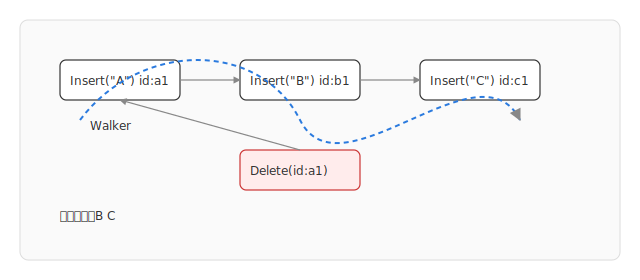
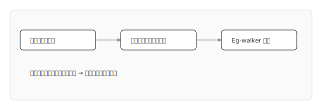
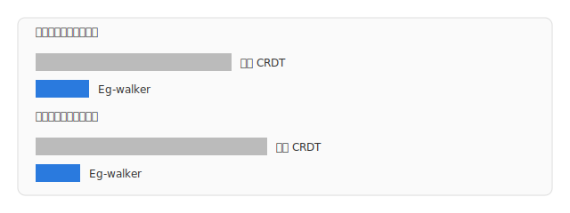

# Collaborative Text Editing with Eg-walker：核心内容总结（保留图为 SVG）

> 来源：Joseph Gentle, Martin Kleppmann, “Collaborative Text Editing with Eg-walker: Better, Faster, Smaller” [arXiv:2409.14252](https://arxiv.org/abs/2409.14252)

## 概述

- 背景：协同文本编辑需在并发下自动合并为一致状态。主流两类算法：
  - OT（Operational Transformation）：分支长期分叉后合并很慢，复杂度随分叉长度上升。
  - CRDT（Conflict-free Replicated Data Type）：加载慢、常驻内存开销大。
- 贡献：提出 Eg-walker（Event Graph Walker），以事件图抽象重构协同算法，达到更低内存、更快加载、更快分支合并：
  - 相较现有 CRDT，稳态内存降低一个数量级，磁盘加载快多个数量级。
  - 相较 OT，长分支合并快多个数量级。
  - 在最坏情况，Eg-walker 的合并性能与主流 CRDT 相当。

## 核心思想

- 事件图抽象：将所有编辑操作视为带因果关系的事件结点（插入、删除等），边表示因果/版本继承，形成有向图。
- 纯函数视角：协同算法定义为对事件图的纯函数，输出当前文本文字序列；避免网络与消息序的耦合。
- Walker 机制：通过在事件图上“行走”生成最终顺序，利用因果拓扑和本地规则决策插入位置与可见性（删除、覆盖）。
- 设计目标：
  - 快速加载：磁盘存储按事件图组织，读取后无需复杂重建即可渲染。
  - 低内存：常驻结构紧凑，避免维护庞大的标识或位置索引。
  - 高效合并：对离线分叉的长分支，行走合并的代价远低于 OT。

## 算法机制（概览）

- 事件建模：每次编辑产生事件结点，包含类型（插入/删除）、内容或引用、作者与时间戳、父版本引用等。
- 因果与可见性：删除事件指向被删除的插入事件，Walker 在行走时根据可见性规则跳过已删除结点。
- 顺序决策：并发插入的相对顺序通过稳定的决策规则（如基于事件 ID/拓扑）确定，避免随客户端不同导致抖动。
- 合并过程：对两个分叉分支的合并可视为将其事件图并入同一图，Walker 基于拓扑顺序遍历即可生成一致文本。

## 性能与复杂度（论文结论摘要）

- 内存占用：稳态比现有 CRDT 小一个数量级。
- 加载速度：磁盘加载快多个数量级（避免冗长重建过程）。
- 分支合并：长分叉场景下合并速度比 OT 快多个数量级。
- 最坏情况：合并性能与现有 CRDT 大致相当。

## 与 OT / CRDT 对比

- OT：需要针对操作序列做成对变换，分叉越长成本越高；Eg-walker 通过图行走降低合并成本。
- 经典文本 CRDT：位置标识与结构冗厚，加载与内存开销大；Eg-walker 设计更紧凑以改善稳态与加载。

## 适用场景与影响

- 离线编辑后回传的长分支合并。
- 大文档协作需要快速应用与低内存占用。
- 在 BFF/网关层进行冲突合并或服务端渲染文本快照。

---

## 图 1：事件图与 Walker 路径（重绘 SVG）

说明：并发/因果关系以箭头表示；删除事件引用被删的插入事件；Walker 按拓扑与可见性规则行走，输出当前可见序列。

## 图 2：加载与渲染管线（重绘 SVG）

## 图 3：相对性能对比（重绘 SVG，示意）

说明：为概念示意，非论文原始数值；体现“数量级”差异结论。

---

## 局限与开放问题（基于论文描述）

- 在某些最坏拓扑/并发模式下合并性能与 CRDT 相当。
- 决策规则需在多客户端间稳定一致，避免边缘序抖动。
- 未来方向：更一般的事件图优化策略、跨文档引用、与富文本/结构化文档的结合。

## 参考

- arXiv 摘要与 HTML 页面：[Collaborative Text Editing with Eg-walker](https://arxiv.org/abs/2409.14252)
- GitHub（论文与实验）：[josephg/egwalker-paper](https://github.com/josephg/egwalker-paper)