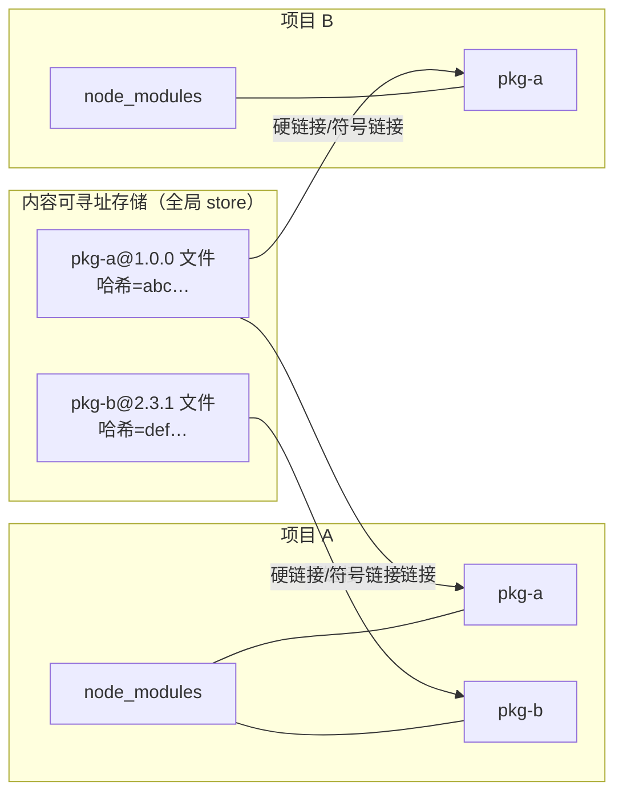
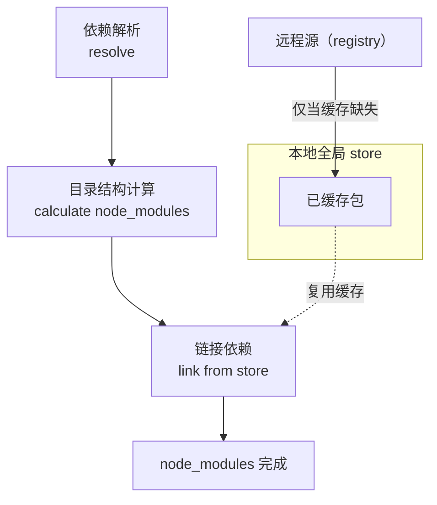

## 节省磁盘空间
pnpm 内容可寻址存储的示意图。 在插图中有两个带有 node_modules 的项目。 node_modules 目录下的文件被硬链接至内容可寻址存储的相同文件处。

使用 npm 时，依赖每次被不同的项目使用，都会重复安装一次。  而在使用 pnpm 时，依赖会被存储在内容可寻址的存储中，所以：

如果你用到了某依赖项的不同版本，只会将不同版本间有差异的文件添加到仓库。 例如，如果某个包有 100 个文件，而它的新版本只改变了其中 1 个文件。那么 pnpm update 时只会向存储中额外添加 1 个新文件，而不会因为单个改变克隆整个依赖。
所有文件都会存储在硬盘上的某一位置。 当软件包被被安装时，包里的文件会硬链接到这一位置，而不会占用额外的磁盘空间。 这允许你跨项目地共享同一版本的依赖。
因此，你在磁盘上节省了大量空间，这与项目和依赖项的数量成正比，并且安装速度要快得多！

## 提高安装速度
pnpm 分三个阶段执行安装：

* 依赖解析。 仓库中没有的依赖都被识别并获取到仓库。
* 目录结构计算。 node_modules 目录结构是根据依赖计算出来的。
* 链接依赖项。 所有以前安装过的依赖项都会直接从存储区中获取并链接到 node_modules。

pnpm安装过程的示意图。 包将被以最快速度解析、获取，并硬链接。

这种方法比传统的三阶段安装过程（解析、获取和写入所有依赖项到 node_modules）要快得多。

Yarn Classic 或 npm 等包管理器如何安装依赖项的说明。

* [pnpm快速的，节省磁盘空间的包管理工具](https://pnpm.io/zh/)

